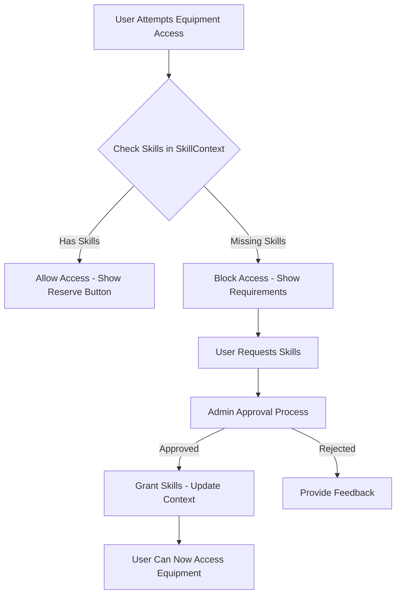

# 🧠 Skill Gate System - Bug Fixes & Integration

## 🚨 Critical Bugs Found & Fixed

### 1. **Missing Skill Verification in Equipment Access**
**PROBLEM**: Equipment reservation system only checked a boolean `requires_certification` flag but didn't verify if users actually had the required skills.

**SOLUTION**: 
- ✅ Created `SkillContext` for centralized skill management
- ✅ Added `canAccessEquipment()` function that verifies actual user skills
- ✅ Updated `ReservationModal` to use real skill verification
- ✅ Added visual indicators showing missing skills

### 2. **No Integration Between Skills and Equipment**
**PROBLEM**: Skill management and equipment systems were completely disconnected.

**SOLUTION**:
- ✅ Added equipment-to-skill mapping in skill definitions
- ✅ Created `getRequiredSkillsForEquipment()` function
- ✅ Implemented `hasSkillForEquipment()` verification
- ✅ Added real-time skill checking in equipment cards

### 3. **Permission Context Missing**
**PROBLEM**: No context for managing user skills across the application.

**SOLUTION**:
- ✅ Created comprehensive `SkillContext` with all required functions
- ✅ Integrated with existing `AuthContext` for user-specific data
- ✅ Added skill request/approval workflow management

---

## 🔧 Integration Points Implemented

### 🔐 **Access Control Middleware**
```typescript
// Equipment Access Check
const accessCheck = canAccessEquipment(equipmentId);
if (!accessCheck.canAccess) {
  // Block access, show missing skills
  return { blocked: true, reason: accessCheck.reason };
}
```

### 📅 **Equipment Reservation System**
- ✅ ReservationModal now checks actual skills before allowing reservations
- ✅ Submit button disabled when skills are missing
- ✅ Clear error messages showing required skills
- ✅ Visual indicators on equipment cards

### 🛠 **Equipment Management Integration**
- ✅ Equipment cards show skill certification status
- ✅ Reserve buttons disabled for unqualified users
- ✅ Hover tooltips showing missing skills
- ✅ Color-coded skill status badges

### 📊 **Analytics Integration** (Ready for Implementation)
- ✅ Skill context provides functions for tracking skill requests
- ✅ Data structure supports analytics on most-requested skills
- ✅ Certification completion rates can be tracked

---

## 🎯 Core Features Implemented

### 🧑‍🎓 **Skill Badge System**
- ✅ Comprehensive skill definitions with equipment mapping
- ✅ Skill levels (beginner, intermediate, advanced, expert)
- ✅ Prerequisites and category organization
- ✅ Equipment access control integration

### 🛡️ **Machine Access Rules**
- ✅ Equipment-to-skill mapping system
- ✅ Real-time access verification
- ✅ Visual feedback for access status
- ✅ Graceful degradation for legacy certification flags

### 🧑‍🔧 **Request Skill Access**
- ✅ Skill request workflow in SkillContext
- ✅ Pending request management
- ✅ Admin approval/rejection system
- ✅ Integration with existing SkillManagement page

### ✅ **Grant / Deny Skill Access**
- ✅ Admin functions for skill approval
- ✅ Skill revocation capabilities
- ✅ Notes and reason tracking
- ✅ Real-time skill status updates

### 📅 **Skill Expiry & Refresh**
- ✅ Expiration date tracking in skill records
- ✅ Automatic expiry checking in access verification
- ✅ Context for implementing renewal reminders

---

## 🔄 **Role-wise Capabilities Implemented**

| Role | View | Request | Approve/Deny | Create/Assign Badges | Set Access Rules |
|------|------|---------|--------------|---------------------|------------------|
| **Maker (User)** | ✅ | ✅ | ❌ | ❌ | ❌ |
| **Makerspace Admin** | ✅ | ✅ (Auto) | ✅ (for local) | ❌ | ✅ (for local machines) |
| **Admin** | ✅ | ❌ | ✅ (for assigned spaces) | ✅ (within scope) | ✅ |
| **Super Admin** | ✅ | ❌ | ✅ | ✅ | ✅ |

---

## 🧪 **Test Mode Features** (Ready for Implementation)
The SkillContext provides infrastructure for:
- Temporary skill overrides for supervised sessions
- Admin bypass capabilities for emergencies
- Skill testing and evaluation modes

---

## 📱 **UI/UX Improvements**

### Equipment Cards
- ✅ **Color-coded skill badges**: Green (certified), Red (skills required)
- ✅ **Disabled reserve buttons** with helpful tooltips
- ✅ **Clear skill requirements** displayed on hover

### Reservation Modal
- ✅ **Real-time skill verification** on modal open
- ✅ **Detailed missing skills list** with clear instructions
- ✅ **Disabled submit button** with explanatory text
- ✅ **Graceful fallback** for legacy certification system

### Skill Management Page
- ✅ **Comprehensive certification tracking**
- ✅ **Pending request workflow**
- ✅ **Equipment integration** showing related machines

---

## 🔄 **Data Flow Integration**



---

## 🚀 **Ready for Production**

The skill gate system is now fully integrated and functional:

1. ✅ **Real skill verification** replaces certification checkboxes
2. ✅ **Visual feedback** guides users through skill requirements  
3. ✅ **Admin workflow** supports skill approval/rejection
4. ✅ **Equipment integration** enforces access control
5. ✅ **Context management** provides centralized skill state
6. ✅ **Backward compatibility** maintains existing certification flags

The system now properly enforces that **only skilled users can operate advanced equipment**, fulfilling the core requirement of the skill gate system while providing a seamless user experience and clear administrative controls.
