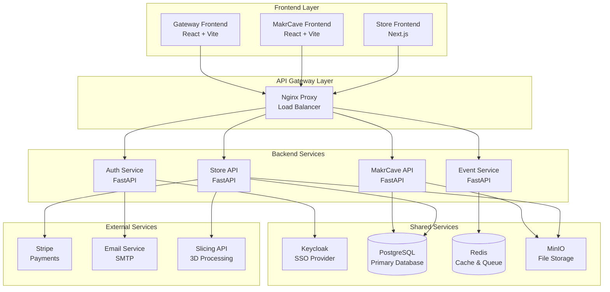
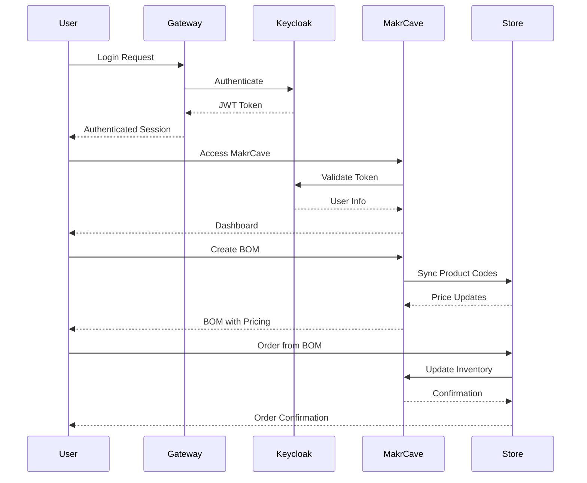

# MakrX System Architecture

## 🏗️ Overview

MakrX is built as a microservices ecosystem with a focus on modularity, scalability, and developer experience. The architecture follows domain-driven design principles with clear separation of concerns across three primary domains.

## 🎯 Design Principles

1. **Domain Separation** - Each domain has its own frontend and backend
2. **API-First** - All interactions happen through well-defined APIs
3. **Shared Services** - Common functionality is centralized
4. **Event-Driven** - Loose coupling through events
5. **Stateless** - Services are stateless for horizontal scaling

## 🏛️ High-Level Architecture



## 🌐 Domain Architecture

### MakrX.org (Gateway)
```
┌─────────────────────────────────────┐
│           Gateway Frontend          │
│         (React + TypeScript)        │
├─────────────────���───────────────────┤
│ Pages:                              │
│ • Landing page                      │
│ • User profiles                     │
│ • Community hub                     │
│ • Ecosystem navigation              │
└─────────────────────────────────────┘
                  │
                  ▼
┌─────────────────────────────────────┐
│           Auth Service              │
│          (FastAPI + JWT)            │
├─────────────────────────────────────┤
│ Responsibilities:                   │
│ • User authentication              │
│ • JWT token management             │
│ • Cross-domain session handling    │
│ • Profile management               │
└─────────────────────────────────────┘
```

### MakrCave.com (Management)
```
┌─────────────────────────────────────┐
│          MakrCave Frontend          │
���         (React + TypeScript)        │
├─────────────────────────────────────┤
│ Modules:                            │
│ • Inventory Management             │
│ • Equipment Reservations           │
│ • Project Collaboration            │
│ • Member Management                │
│ • Service Provider Portal          │
│ • Analytics Dashboard              │
└─────────────────────────────────────┘
                  │
                  ▼
┌─────────────────────────────────────┐
│           MakrCave API              │
│         (FastAPI + SQLAlchemy)      │
├─────────────────────────────────────┤
│ Core Services:                      │
│ • Makerspace CRUD                  │
│ • Equipment management             │
│ • Inventory tracking               │
│ • Project management               │
│ • BOM management                   │
│ • Job processing                   │
│ • Analytics engine                 │
��─────────────────────────────────────┘
```

### MakrX.Store (E-commerce)
```
┌─────────────────────────────────────┐
│           Store Frontend            │
│         (Next.js + TypeScript)      │
├─────────────────────────────────────┤
│ Features:                           │
│ • Product catalog                  │
│ • Shopping cart                    │
│ • Checkout flow                    │
│ • Order management                 │
│ • Fabrication services            │
│ • STL upload & quoting             │
└─────────────────────────────────────┘
                  │
                  ▼
┌─────────────────────────────────────┐
│            Store API                │
│         (FastAPI + SQLAlchemy)      │
├─────────────────────────────────────┤
│ Commerce Services:                  │
��� • Product management               │
│ • Order processing                 │
│ • Payment integration              │
│ • Inventory sync                   │
│ • Fabrication quotes               │
│ • Provider network                 │
└─────────────────────────────────────┘
```

## 🔄 Data Flow Architecture

### Cross-Domain Communication



## 🗄️ Database Architecture

### Schema Design Principles
- **Domain Separation**: Each domain has its own schema
- **Shared Tables**: Common entities in shared schema
- **Foreign Keys**: Cross-domain references via UUID
- **Audit Trails**: All changes tracked with timestamps

### Schema Organization
```sql
-- Shared Schema
shared.users
shared.roles
shared.permissions
shared.feature_flags
shared.audit_logs

-- MakrCave Schema
makrcave.makerspaces
makrcave.members
makrcave.equipment
makrcave.inventory
makrcave.projects
makrcave.boms
makrcave.jobs

-- Store Schema
store.products
store.categories
store.orders
store.order_items
store.cart
store.reviews
store.providers
```

## 🔐 Security Architecture

### Authentication Flow
1. **Primary Auth**: Keycloak handles all authentication
2. **JWT Tokens**: Stateless token-based auth
3. **Refresh Mechanism**: Automatic token renewal
4. **Cross-Domain**: Shared session across domains

### Authorization Model
```
User → Roles → Permissions → Resources
     → Makerspace Membership → Scoped Access
     → Feature Flags → Dynamic Features
```

## 📡 API Design

### RESTful Conventions
- **GET** `/api/v1/resource` - List resources
- **GET** `/api/v1/resource/{id}` - Get specific resource
- **POST** `/api/v1/resource` - Create resource
- **PUT** `/api/v1/resource/{id}` - Update resource
- **DELETE** `/api/v1/resource/{id}` - Delete resource

### Response Format
```json
{
  "success": true,
  "data": { /* response data */ },
  "message": "Optional message",
  "meta": {
    "total": 100,
    "page": 1,
    "limit": 20
  }
}
```

### Error Format
```json
{
  "success": false,
  "error": {
    "code": "VALIDATION_ERROR",
    "message": "Invalid input data",
    "details": [
      {
        "field": "email",
        "message": "Invalid email format"
      }
    ]
  }
}
```

## 🚀 Deployment Architecture

### Development Environment
```yaml
services:
  # Frontend services (development)
  gateway-frontend:  # Vite dev server
  makrcave-frontend: # Vite dev server  
  store-frontend:    # Next.js dev server
  
  # Backend services
  makrcave-api:      # FastAPI with hot reload
  store-api:         # FastAPI with hot reload
  auth-service:      # FastAPI with hot reload
  
  # Infrastructure
  postgres:          # Database
  redis:             # Cache & queue
  keycloak:          # SSO provider
  minio:             # File storage
  nginx:             # Reverse proxy
```

### Production Environment
```yaml
services:
  # Frontend services (static)
  nginx:             # Serves static files + proxy
  
  # Backend services (clustered)
  makrcave-api:      # Multiple instances
  store-api:         # Multiple instances
  auth-service:      # Multiple instances
  
  # Infrastructure (managed)
  postgres:          # Managed database
  redis:             # Managed cache
  keycloak:          # Managed SSO
  s3:                # Cloud storage
  cdn:               # Content delivery
  load-balancer:     # Traffic distribution
```

## 📊 Monitoring & Observability

### Health Checks
- **Application Health**: `/health` endpoints on all services
- **Database Health**: Connection pool monitoring
- **External Services**: Dependency health checks
- **Performance Metrics**: Response time tracking

### Logging Strategy
- **Structured Logging**: JSON format with correlation IDs
- **Log Levels**: DEBUG, INFO, WARN, ERROR, CRITICAL
- **Centralized**: All logs aggregated
- **Retention**: 30 days development, 90 days production

## 🔧 Development Tools

### Code Organization
- **Monorepo**: All code in single repository
- **Workspaces**: npm/yarn workspaces for dependencies
- **Shared Packages**: Common code in `/packages`
- **Type Safety**: TypeScript across entire stack

### Development Workflow
1. **Local Setup**: Docker Compose for infrastructure
2. **Hot Reload**: All services support live reload
3. **API Testing**: Automated API documentation
4. **Type Generation**: API types auto-generated for frontend

## 🚦 Performance Considerations

### Frontend Optimization
- **Code Splitting**: Lazy-loaded routes and components
- **Bundle Analysis**: Webpack bundle analyzer
- **Caching**: Service worker for offline capability
- **CDN**: Static assets served from CDN

### Backend Optimization
- **Connection Pooling**: Database connection management
- **Caching**: Redis for frequently accessed data
- **Async Processing**: Background jobs for heavy tasks
- **Database Indexing**: Optimized queries

### Infrastructure Scaling
- **Horizontal Scaling**: Stateless services
- **Load Balancing**: Traffic distribution
- **Auto-scaling**: Based on CPU/memory usage
- **CDN**: Global content delivery

---

This architecture provides a solid foundation for the MakrX ecosystem, ensuring scalability, maintainability, and developer productivity while delivering excellent user experience across all domains.
