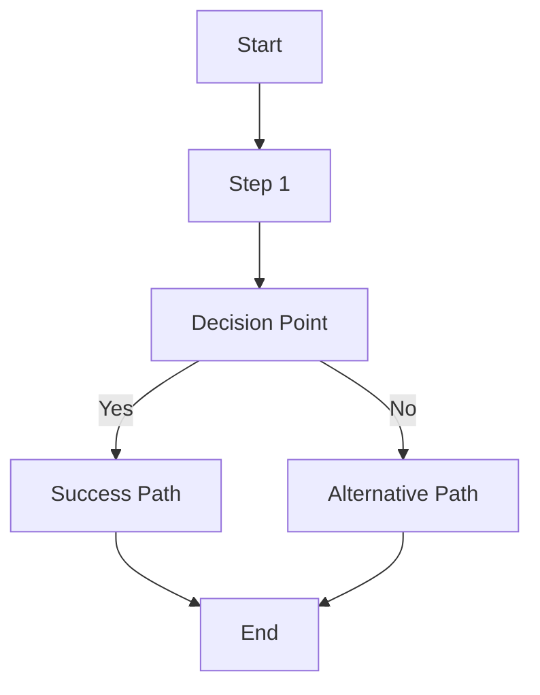

# Feature Documentation Template

Use this template for documenting each feature in the MakrX ecosystem.

---

## [Feature Name] - [Brief Summary]

### Purpose
What problem does this feature solve? Why was it built?

### Which Domains Use It
- [ ] MakrX.org (Gateway)
- [ ] MakrCave.com (Management)  
- [ ] MakrX.Store (E-commerce)
- [ ] Cross-domain functionality

### Who Can Access It
| Role | Access Level | Notes |
|------|-------------|-------|
| Super Admin | Full | All functionality |
| Admin | Limited | Domain-specific |
| Makerspace Admin | Conditional | Within their makerspace |
| Service Provider | Conditional | Provider-specific features |
| Member | Basic | Core functionality |
| Store Customer | Public | Store-specific access |
| Guest | Read-only | Public information only |

### Flow Diagram


### Backend API Endpoints

#### Primary Endpoints
| Method | URL | Required Role | Purpose | Request Body | Response |
|--------|-----|---------------|---------|--------------|----------|
| GET | `/api/endpoint` | Role | Description | N/A | `{response}` |
| POST | `/api/endpoint` | Role | Description | `{request}` | `{response}` |

#### Example Requests/Responses
```bash
# Example API call
curl -X POST http://localhost:8002/api/example \
  -H "Authorization: Bearer $TOKEN" \
  -H "Content-Type: application/json" \
  -d '{
    "param1": "value1",
    "param2": "value2"
  }'

# Example response
{
  "success": true,
  "data": {
    "id": "uuid",
    "created_at": "2024-01-15T10:00:00Z"
  },
  "message": "Operation completed successfully"
}
```

### Frontend UI Components/Pages

#### Components Used
- **ComponentName** (`components/ComponentName.tsx`)
  - Purpose: What it does
  - Props: Key properties and their types
  - Usage: Where it's used

#### Pages Involved
- **PageName** (`pages/PageName.tsx`)
  - Route: `/route-path`
  - Purpose: What the page accomplishes
  - Components: Which components it uses

#### UI Flow
1. User starts at [specific page/component]
2. User performs [action]
3. System responds with [behavior]
4. User sees [result]

### Database Tables Involved

#### Primary Tables
```sql
-- Main table for this feature
CREATE TABLE feature_table (
    id UUID PRIMARY KEY DEFAULT gen_random_uuid(),
    name VARCHAR(255) NOT NULL,
    created_at TIMESTAMP WITH TIME ZONE DEFAULT NOW(),
    updated_at TIMESTAMP WITH TIME ZONE DEFAULT NOW()
);
```

#### Related Tables
- **table_name**: How it relates to the feature
- **another_table**: Its role in the feature

#### Key Relationships
```sql
-- Foreign key relationships
ALTER TABLE feature_table 
ADD CONSTRAINT fk_user_id 
FOREIGN KEY (user_id) REFERENCES users(id);
```

### Feature Flag (if any)

#### Flag Definition
```typescript
FEATURE_NAME: {
  name: 'FEATURE_NAME',
  enabled: false,
  environments: ['development'],
  description: 'Enable [feature description]',
  rolloutPercentage: 0
}
```

#### Usage in Code
```typescript
// Frontend usage
if (isEnabled('FEATURE_NAME')) {
  // Show new feature
} else {
  // Show fallback or nothing
}

// Backend usage
if is_feature_enabled("FEATURE_NAME"):
    # Execute feature code
    pass
```

#### Rollout Plan
1. **Development**: Enable for testing
2. **Staging**: Full testing with QA team
3. **Production Pilot**: 5% of users
4. **Gradual Rollout**: 25% → 50% ��� 100%
5. **Flag Removal**: After 2 weeks stable

### Notes/Edge Cases

#### Known Limitations
- Limitation 1: Description and workaround
- Limitation 2: Description and impact

#### Edge Cases Handled
- Case 1: How the system handles it
- Case 2: Expected behavior

#### Future Improvements
- Improvement 1: Planned enhancement
- Improvement 2: Technical debt to address

### Testing Checklist

#### Unit Tests
- [ ] Core functionality tested
- [ ] Error conditions handled
- [ ] Edge cases covered
- [ ] Mocked dependencies

#### Integration Tests  
- [ ] API endpoints tested
- [ ] Database operations verified
- [ ] Cross-service communication tested
- [ ] Authentication/authorization verified

#### Manual Testing
- [ ] Happy path user flow
- [ ] Error scenarios
- [ ] Different user roles
- [ ] Cross-browser compatibility (frontend)
- [ ] Mobile responsiveness (frontend)

### Security Considerations

#### Authentication/Authorization
- How is access controlled?
- What permissions are required?
- How are API calls secured?

#### Data Protection
- What personal data is involved?
- How is sensitive data handled?
- Are there data retention requirements?

#### Input Validation
- What inputs need validation?
- How is malicious input prevented?
- Are there rate limiting requirements?

### Performance Considerations

#### Expected Load
- How many users will use this feature?
- What's the expected request volume?
- Are there peak usage times?

#### Performance Optimizations
- Caching strategy implemented
- Database query optimization
- Frontend performance considerations

### Monitoring & Alerting

#### Key Metrics
- Success rate of operations
- Average response time
- Error rates and types
- User adoption metrics

#### Alerts
- When should alerts be triggered?
- Who should be notified?
- What escalation procedures exist?

### Documentation Links

#### Related Documentation
- [Link to related feature docs]
- [Link to API documentation]
- [Link to architecture decisions]

#### External Resources
- [Third-party service documentation]
- [Design specifications]
- [User research findings]

---

**Feature Owner**: [Team/Individual responsible]  
**Last Updated**: [Date]  
**Version**: [Feature version]  
**Status**: [Development/Testing/Production/Deprecated]
