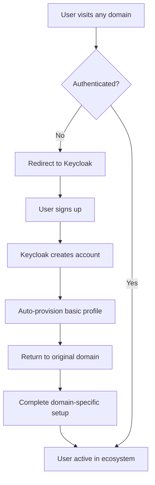
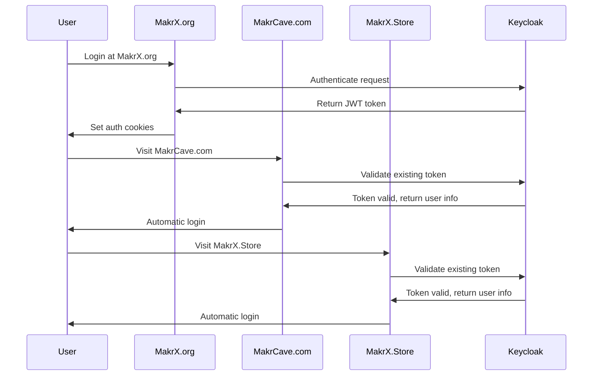
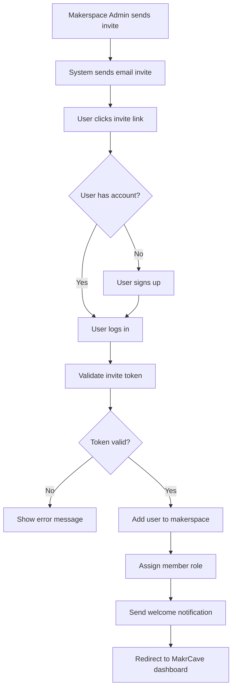
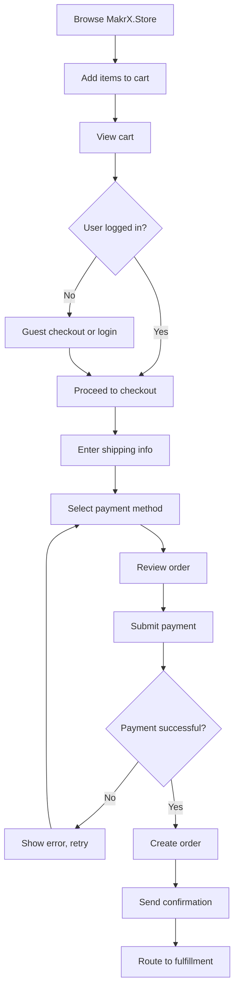
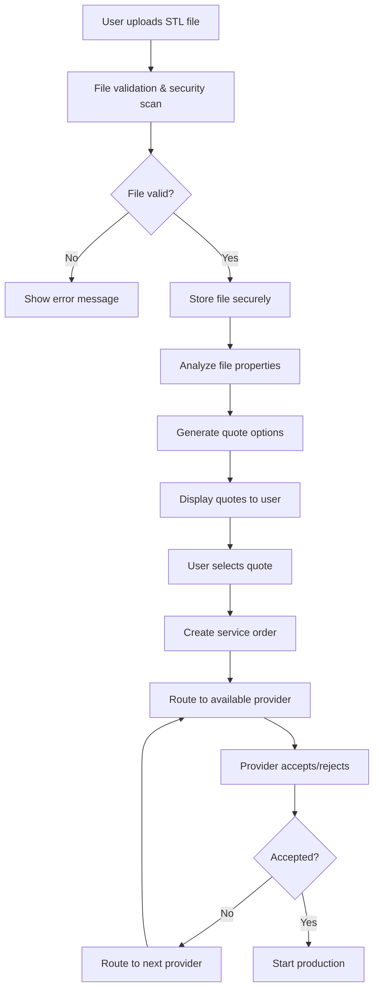
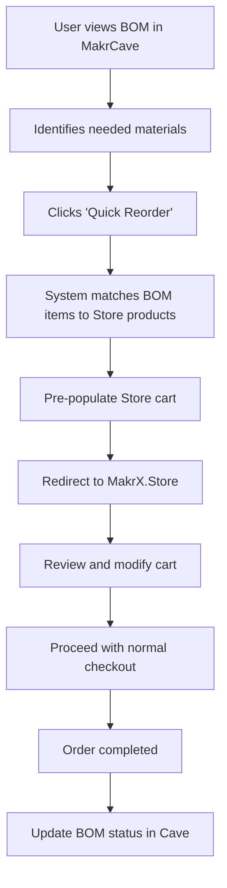
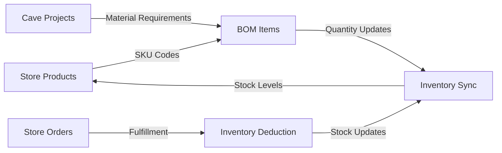

# MakrX Ecosystem Documentation

**Tagline: Dream, Make, Share.**

Welcome to MakrX - a comprehensive ecosystem for makers, not just an OS, but a complete platform that connects creators, makerspaces, and service providers globally.

## 📋 Table of Contents

1. [Overview & Vision](#overview--vision)
2. [System Architecture](#system-architecture)
3. [Domains & Their Roles](#domains--their-roles)
4. [User Roles & Access Control](#user-roles--access-control)
5. [Feature Flags](#feature-flags)
6. [Key Flows](#key-flows)
7. [Integration Map](#integration-map)
8. [Backend Documentation](#backend-documentation)
9. [Frontend Documentation](#frontend-documentation)
10. [Database Schema](#database-schema)
11. [Security & Compliance](#security--compliance)
12. [Deployment Guide](#deployment-guide)
13. [Contribution Guidelines](#contribution-guidelines)
14. [Appendix](#appendix)

---

## 1. Overview & Vision

### Purpose: Why MakrX Exists

MakrX exists to democratize manufacturing and empower the global maker community. We bridge the gap between individual creators and professional fabrication services, creating an ecosystem where anyone can bring their ideas to life.

**Core Problems We Solve:**
- Fragmented maker tools and services
- Difficulty accessing professional fabrication
- Lack of integration between design, ordering, and production
- Isolation of maker communities

### Ecosystem Definition

MakrX is an **ecosystem for makers** - a unified platform that connects:
- Individual makers and creators
- Makerspaces and community workshops
- Service providers and manufacturers
- Tools, materials, and knowledge

**Not an "OS" but an ecosystem** - we provide the interconnected infrastructure that makes the maker economy work.

### High-Level Modules

The MakrX ecosystem consists of three primary domains:

1. **MakrX.org** - Gateway and maker hub
2. **MakrCave.com** - Makerspace & service provider portal  
3. **MakrX.Store** - E-commerce & fabrication services

Future modules may include specialized portals for education, enterprise, and regional markets.

### Goals

**Simplicity**: Complex workflows made simple through intelligent automation
**Integration**: Seamless connections between design, ordering, and production
**Growth**: Expanding maker communities through accessible tools and services

---

## 2. System Architecture

### High-Level Architecture Diagram

```
┌─────────────────────────────────────────────────────────────────┐
│                        MakrX Ecosystem                          │
├─────────────────────────────────────────────────────────────────┤
│                         Frontends                               │
├─────────────────┬─────────────────┬─────────────────────────────┤
│   MakrX.org     │   MakrCave.com  │      MakrX.Store            │
│   (Gateway)     │   (Management)   │    (E-commerce)             │
│   React + Vite  │   React + Vite   │    Next.js                  │
│   Port: 3000    │   Port: 3001     │    Port: 3003               │
└─────────────────┴─────────────────┴──────────���──────────────────┘
                             │
                    ┌────────┼────────┐
                    │        │        │
┌─────────────────────────────────────────────────────────────────┐
│                       Backend Services                          │
├─────────────────┬─────────────────┬─────────────────────────────┤
│   Auth Service  │ MakrCave Backend│   Store Backend             │
│   FastAPI       │   FastAPI       │   FastAPI                   │
│   Port: 8001    │   Port: 8002    │   Port: 8003                │
└─────────────────┴─────────────────┴─────────────────────────────┘
                             │
                    ┌────────┼────────┐
                    │        │        │
┌────────────────���────────────────────────────────────────────────┐
│                    Shared Services                              │
├─────────────────┬─────────────────┬─────────────────────────────┤
│    Keycloak     │   PostgreSQL    │      MinIO/S3               │
│     (SSO)       │   (Database)    │   (File Storage)            │
│   Port: 8080    │   Port: 5432    │   Port: 9000                │
└─────────────────┴─────────────────┴─────────────────────────────┘
```

### API Communication Lines

```
MakrX.org ←──────→ Auth Service (8001)
    │
    ├──────────────→ MakrCave Backend (8002) [Profile sync]
    │
    └──────────────→ Store Backend (8003) [Order history]

MakrCave.com ←───→ MakrCave Backend (8002)
    │
    ├──────────────→ Store Backend (8003) [BOM ordering]
    │
    └────���─────────→ Auth Service (8001) [SSO]

MakrX.Store ←────→ Store Backend (8003)
    │
    ├──────────────→ MakrCave Backend (8002) [Job routing]
    │
    └──────────────→ Auth Service (8001) [SSO]
```

### Hosting Setup

**Local Development**: Docker Compose
**Production Options**: 
- Docker + VPS (current)
- Kubernetes (future scalability)

### Tech Stack per Layer

#### Frontend Layer
- **Framework**: React 18 + TypeScript
- **Build Tools**: Vite (gateway/cave), Next.js (store)
- **Styling**: Tailwind CSS + shadcn/ui
- **State**: React Context + hooks
- **Auth**: Keycloak-js integration

#### Backend Layer  
- **Framework**: FastAPI + Python 3.11+
- **Database**: SQLAlchemy + asyncpg (PostgreSQL)
- **Auth**: Keycloak integration + JWT
- **API**: RESTful + WebSocket (future)
- **File Storage**: MinIO/S3 compatible

#### Infrastructure Layer
- **Containerization**: Docker + Docker Compose
- **Reverse Proxy**: Nginx
- **Database**: PostgreSQL 15
- **Identity**: Keycloak
- **Monitoring**: Built-in health checks + logging

---

## 3. Domains & Their Roles

### MakrX.org - Gateway & Maker Hub
**URL**: https://makrx.org  
**Port**: 3000 (development)

**Primary Purpose**: 
- Ecosystem entry point and navigation
- Maker profiles and community features
- Cross-domain authentication hub

**Key Features**:
- Landing page with ecosystem overview
- User profile management
- Portal navigation to other domains
- Community features and maker spotlights
- Authentication and SSO coordination

**Target Users**: All ecosystem users, first-time visitors

### MakrCave.com - Makerspace & Service Provider Portal
**URL**: https://makrcave.com  
**Port**: 3001 (development)

**Primary Purpose**:
- Makerspace management and operations
- Service provider tools and dashboards
- Job management and equipment tracking

**Key Features**:
- Equipment reservation and management
- Member management and billing
- Project tracking and collaboration
- BOM management and ordering integration
- Analytics and reporting
- Service provider dashboards

**Target Users**: Makerspace admins, service providers, makerspace members

### MakrX.Store - E-commerce & Fabrication Services
**URL**: https://makrx.store  
**Port**: 3003 (development)

**Primary Purpose**:
- E-commerce platform for maker materials and tools
- Professional fabrication services
- 3D printing and manufacturing services

**Key Features**:
- Product catalog and shopping cart
- 3D file upload and quoting system
- Order management and tracking
- Service provider marketplace
- Payment processing and billing
- Integration with MakrCave for BOM ordering

**Target Users**: Individual makers, businesses, anyone needing fabrication services

### Core Differences and Linking

| Aspect | MakrX.org | MakrCave.com | MakrX.Store |
|--------|-----------|--------------|-------------|
| **Focus** | Community & Navigation | Operations & Management | Commerce & Services |
| **Auth** | Primary SSO hub | Inherited from .org | Inherited from .org |
| **Data** | User profiles, community | Projects, equipment, members | Products, orders, quotes |
| **Billing** | None | Makerspace subscriptions | E-commerce transactions |
| **Integration** | Links to all domains | BOM → Store orders | Job routing → Cave |

**Cross-Domain Linking**:
- Single Sign-On (SSO) across all domains
- Shared user profiles and preferences
- BOM items in Cave link to Store products
- Store service orders route to Cave providers
- Unified notification system

---

## 4. User Roles & Access Control

### Role Definitions

#### Global Roles (across all domains)

**Super Admin**
- Full system access across all domains
- Can manage global settings and feature flags
- Access to all makerspaces and administrative functions
- User management and role assignment

**Admin** 
- Domain-specific administrative access
- Can manage users within their domain
- Access to analytics and reporting
- Configuration management for their domain

#### Domain-Specific Roles

**MakrCave-Specific Roles:**

**Makerspace Admin**
- Full control over their makerspace
- Member management and billing
- Equipment and resource management
- Analytics for their makerspace only

**Service Provider**
- Manage service offerings and pricing
- Handle incoming job requests
- Equipment and capacity management
- Performance analytics

**Member**
- Access to their makerspace resources
- Equipment reservations and usage
- Project management and collaboration
- Billing and payment management

**MakrX.Store-Specific Roles:**

**Store Customer**
- Browse and purchase products
- Upload files for fabrication quotes
- Order tracking and management
- Basic profile management

**Guest** (unauthenticated)
- Browse public product catalog
- View sample projects and services
- Access public information pages
- Limited to read-only access

### Global vs Domain-Specific Permissions

**Global Permissions** (inherited across domains):
- User authentication state
- Profile information and preferences
- Cross-domain navigation rights
- Notification preferences

**Domain-Specific Permissions**:
- Resource access within makerspaces
- Administrative functions per domain
- Billing and subscription management
- Feature access based on membership tier

### Makerspace Membership Rules

**Invite-Only System**:
1. Makerspaces are private communities
2. Members must be invited by Makerspace Admin
3. Invitation includes role assignment (Member/Admin)
4. Self-registration is not allowed for makerspaces
5. Users can belong to multiple makerspaces with different roles

**Membership Lifecycle**:
```
Guest → Invited → Member → [Promoted to Admin] → [Removed]
```

### Access Matrix Table

| Feature | Super Admin | Admin | Makerspace Admin | Service Provider | Member | Store Customer | Guest |
|---------|-------------|-------|------------------|------------------|--------|----------------|-------|
| **Global Features** |
| Cross-domain SSO | ✅ | ✅ | ✅ | ✅ | ✅ | ✅ | ❌ |
| User profile management | ✅ | ✅ | ✅ | ✅ | ✅ | ✅ | ❌ |
| System feature flags | ✅ | ❌ | ❌ | ❌ | ❌ | ❌ | ❌ |
| **MakrX.org Features** |
| Community features | ✅ | ✅ | ✅ | ✅ | ✅ | ✅ | 👁️ |
| Maker profiles | ✅ | ✅ | ✅ | ✅ | ✅ | ✅ | 👁️ |
| **MakrCave Features** |
| Equipment management | ✅ | ✅ | ✅ | ✅ | 👁️ | ❌ | ❌ |
| Member management | ✅ | ✅ | ✅ | ❌ | ❌ | ❌ | ❌ |
| Equipment reservations | ✅ | ✅ | ✅ | ✅ | ✅ | ❌ | ❌ |
| Project management | ✅ | ✅ | ✅ | ✅ | ✅ | ❌ | ❌ |
| Billing management | ✅ | ✅ | ✅ | ❌ | 👁️ | ❌ | ❌ |
| Analytics dashboard | ✅ | ✅ | ✅ | ✅ | ❌ | ❌ | ❌ |
| **MakrX.Store Features** |
| Product browsing | ✅ | ✅ | ✅ | ✅ | ✅ | ✅ | ✅ |
| Purchase products | ✅ | ✅ | ✅ | ✅ | ✅ | ✅ | ❌ |
| Upload files for quotes | ✅ | ✅ | ✅ | ✅ | ✅ | ✅ | ❌ |
| Order management | ✅ | ✅ | ✅ | ✅ | ✅ | ✅ | ❌ |
| Service provider tools | ✅ | ✅ | ❌ | ✅ | ❌ | ❌ | ❌ |

**Legend**: ✅ Full Access | 👁️ Read Only | ❌ No Access

---

## 5. Feature Flags

### What They Are in MakrX

Feature flags in MakrX enable controlled rollout of new functionality without requiring code deployments. They allow us to:
- Test features with specific user groups
- Gradually roll out new functionality
- Quickly disable problematic features
- A/B test different implementations
- Manage feature access by user role or makerspace

### Global vs Domain-Specific Flags

**Global Flags** (affect entire ecosystem):
```typescript
ENABLE_CROSS_DOMAIN_NOTIFICATIONS: boolean
MAINTENANCE_MODE: boolean
ENABLE_NEW_AUTHENTICATION_FLOW: boolean
ENABLE_UNIFIED_SEARCH: boolean
```

**Domain-Specific Flags**:

**MakrX.org Flags**:
```typescript
ENABLE_COMMUNITY_FEATURES: boolean
SHOW_MAKER_SPOTLIGHT: boolean
ENABLE_PORTAL_NAVIGATION_V2: boolean
```

**MakrCave Flags**:
```typescript
ENABLE_ADVANCED_ANALYTICS: boolean
ENABLE_BOM_ORDERING: boolean
ENABLE_REAL_TIME_EQUIPMENT_STATUS: boolean
ENABLE_AUTOMATED_BILLING: boolean
ENABLE_PROJECT_COLLABORATION: boolean
```

**MakrX.Store Flags**:
```typescript
ENABLE_STL_UPLOAD: boolean
ENABLE_QUICK_REORDER: boolean
ENABLE_NEW_CHECKOUT_FLOW: boolean
ENABLE_SERVICE_MARKETPLACE: boolean
ENABLE_ADVANCED_SEARCH: boolean
```

### Example Use Cases

**Enable STL Upload**:
```typescript
// Feature flag controls 3D file upload functionality
if (isEnabled('ENABLE_STL_UPLOAD')) {
  // Show upload interface and processing
} else {
  // Show "coming soon" message
}
```

**Disable BOM Ordering**:
```typescript
// Temporarily disable BOM integration during maintenance
if (isEnabled('ENABLE_BOM_ORDERING')) {
  // Show "Order from Store" buttons
} else {
  // Hide ordering functionality
}
```

**Beta Features**:
```typescript
// Advanced analytics only for premium makerspaces
if (isEnabled('ENABLE_ADVANCED_ANALYTICS') && user.hasPremiumAccess) {
  // Show advanced dashboard
}
```

### Flag Governance (Who Can Change Them)

**Super Admin**:
- All global flags
- All domain-specific flags
- Emergency flag toggles

**Domain Admin**:
- Domain-specific flags only
- Cannot modify global flags
- Cannot modify flags affecting other domains

**Makerspace Admin**:
- Makerspace-specific feature flags only
- Cannot modify global or domain flags

**Flag Change Process**:
1. Propose flag change with justification
2. Review impact on affected users
3. Test in staging environment
4. Get approval from appropriate admin level
5. Document change and monitor impact

---

## 6. Key Flows

### Signup → Ecosystem Auto-Provisioning



**Steps**:
1. User visits MakrX.org, MakrCave.com, or MakrX.Store
2. System checks authentication status
3. If not authenticated, redirect to Keycloak SSO
4. User completes signup with email/password or social login
5. System auto-provisions:
   - Basic user profile
   - Default preferences
   - Cross-domain access tokens
6. User returns to original domain with active session
7. Domain-specific onboarding begins (if needed)

### SSO Behavior Across Domains



**Key Points**:
- Single authentication works across all domains
- JWT tokens are shared via secure cookies
- No re-authentication required when switching domains
- Token refresh happens automatically
- Logout from any domain logs out from all domains

### Invite & Join Makerspace



**Process**:
1. Makerspace Admin enters user email and role
2. System generates secure invite token (24-hour expiry)
3. Email sent with personalized invite link
4. User clicks link and authenticates (signup if needed)
5. System validates invite token
6. User added to makerspace with specified role
7. Welcome notification sent
8. User redirected to their new makerspace dashboard

### Order Product (Store)



**Key Features**:
- Guest checkout supported
- Saved addresses for logged-in users
- Multiple payment methods
- Real-time inventory checking
- Automatic tax calculation
- Integration with fulfillment providers

### Upload STL → Job Routing (Cave)



**Process Details**:
1. File upload with progress indicator
2. Virus scanning and format validation
3. 3D analysis for printability and volume
4. Multiple quote generation (materials, quality levels)
5. Smart routing to qualified service providers
6. Real-time status updates
7. Quality control and shipping coordination

### Quick Reorder (Cave → Store)



**Integration Points**:
- BOM items have product codes that match Store SKUs
- Quantities automatically calculated based on project needs
- User preferences for suppliers and materials applied
- Cross-domain cart synchronization
- Automatic inventory checking

---

## 7. Integration Map

### API Endpoints Between Domains

#### Store ↔ Cave Integration

**MakrX.Store → MakrCave Backend**:
```
POST /api/v1/jobs/route-service-order
- Route fabrication orders to makerspaces
- Payload: service_order_id, requirements, preferences

GET /api/v1/providers/available
- Get list of available service providers
- Query: service_type, location, capacity

POST /api/v1/bom/sync-inventory
- Sync inventory levels for BOM planning
- Payload: product_codes[], quantities[]
```

**MakrCave Backend → MakrX.Store**:
```
POST /api/v1/orders/quick-reorder
- Create orders from BOM requirements
- Payload: bom_items[], makerspace_id, user_id

GET /api/v1/products/by-codes
- Get product details by SKU codes
- Query: codes[], include_inventory=true

POST /api/v1/cart/bulk-add
- Add multiple items to user's cart
- Payload: items[], user_id, session_id
```

#### Cave ↔ Org Integration

**MakrCave Backend → MakrX.org**:
```
POST /api/v1/profiles/sync
- Sync user achievements and project highlights
- Payload: user_id, achievements[], featured_projects[]

GET /api/v1/community/members
- Get community member information
- Query: makerspace_id, role_filter
```

**MakrX.org → MakrCave Backend**:
```
GET /api/v1/user/makerspaces
- Get user's makerspace memberships
- Response: makerspace_list[], roles[], permissions[]

POST /api/v1/invites/validate
- Validate makerspace invite tokens
- Payload: invite_token, user_id
```

#### Store ↔ Org Integration

**MakrX.Store → MakrX.org**:
```
POST /api/v1/activity/purchase
- Log purchase activity for user profiles
- Payload: user_id, order_id, product_categories[]

GET /api/v1/preferences/shipping
- Get user's shipping preferences
- Response: addresses[], default_shipping_method
```

### Shared Services

#### Keycloak (Identity Management)
**Base URL**: http://localhost:8080 (dev) / https://auth.makrx.org (prod)

**Realms**:
- `makrx` - Main ecosystem realm

**Clients**:
- `makrx-org-frontend` - MakrX.org application
- `makrcave-frontend` - MakrCave.com application  
- `makrx-store-frontend` - MakrX.Store application
- `auth-service` - Backend authentication service
- `makrcave-backend` - MakrCave backend service
- `store-backend` - Store backend service

**Token Flow**:
```
Frontend → Keycloak (authenticate) → JWT Token → Backend (validate)
```

#### PostgreSQL Database
**Connection**: Shared database with schema separation

**Shared Tables**:
- `users` - Global user accounts
- `feature_flags` - System-wide feature toggles
- `audit_logs` - Cross-system audit trail

**Service-Specific Schemas**:
- `makrcave.*` - Makerspace and project data
- `store.*` - E-commerce and order data
- `auth.*` - Authentication and session data

#### MinIO/S3 (File Storage)
**Buckets**:
- `makrx-uploads` - STL files and project uploads
- `makrx-products` - Product images and assets
- `makrx-public` - Public assets and downloads

**Access Control**:
- Pre-signed URLs for secure file access
- Time-limited upload permissions
- Virus scanning on upload

#### Payment Gateways
**Primary**: Stripe (development and production)
**Backup**: PayPal (future implementation)

**Webhooks**:
```
Stripe → Store Backend → Order status updates
PayPal → Store Backend → Payment confirmations
```

### Data Sync Logic

#### Product Codes & Inventory


**Sync Schedule**:
- Real-time: Critical stock levels, order updates
- Hourly: Inventory levels, pricing changes
- Daily: Analytics data, reporting metrics

#### User Profile Sync
- Authentication state: Real-time via JWT tokens
- Profile information: On-demand with caching
- Preferences: Real-time via event system
- Activity logs: Asynchronous batch processing

---

## Quick Navigation

### 📖 Complete Documentation Files
- **[Complete Ecosystem Guide](./COMPLETE_ECOSYSTEM_GUIDE.md)** - Backend, Frontend, Database documentation
- **[Security, Deployment & Contribution Guide](./SECURITY_DEPLOYMENT_CONTRIBUTION.md)** - Security, deployment, and contribution guidelines
- **[Feature Documentation Template](./FEATURE_TEMPLATE.md)** - Template for documenting new features

### 🔧 Development Quick Start
```bash
# Clone and start development environment
git clone https://github.com/makrx/ecosystem.git
cd ecosystem
docker-compose up -d

# Access the applications
# MakrX.org: http://localhost:3000
# MakrCave.com: http://localhost:3001
# MakrX.Store: http://localhost:3003
```

### 🎯 For New Developers

1. **Start Here**: Read this entire README for ecosystem overview
2. **Architecture**: Review [System Architecture](#system-architecture) section
3. **Setup**: Follow [Deployment Guide - Local Development](./SECURITY_DEPLOYMENT_CONTRIBUTION.md#local-development-docker-compose-up)
4. **Code**: Check [Contribution Guidelines](./SECURITY_DEPLOYMENT_CONTRIBUTION.md#contribution-guidelines)
5. **Features**: Use [Feature Template](./FEATURE_TEMPLATE.md) for new features

### 📊 Documentation Status

| Section | Status | Last Updated |
|---------|--------|--------------|
| Overview & Architecture | ✅ Complete | 2024-01-15 |
| User Roles & Access | ✅ Complete | 2024-01-15 |
| Feature Flags | ✅ Complete | 2024-01-15 |
| Key Flows | ✅ Complete | 2024-01-15 |
| Integration Map | ✅ Complete | 2024-01-15 |
| Backend Documentation | ✅ Complete | 2024-01-15 |
| Frontend Documentation | ✅ Complete | 2024-01-15 |
| Database Schema | ✅ Complete | 2024-01-15 |
| Security & Compliance | ✅ Complete | 2024-01-15 |
| Deployment Guide | ✅ Complete | 2024-01-15 |
| Contribution Guidelines | ✅ Complete | 2024-01-15 |

### 🆘 Getting Help

- **Technical Issues**: Create issue in main repository
- **Documentation**: Contact development team
- **Security**: Email security@makrx.org
- **General**: Join maker community discussions

---

**Dream. Make. Share.**

**Version**: 1.0.0 | **Authors**: MakrX Development Team | **Last Updated**: 2024-01-15
