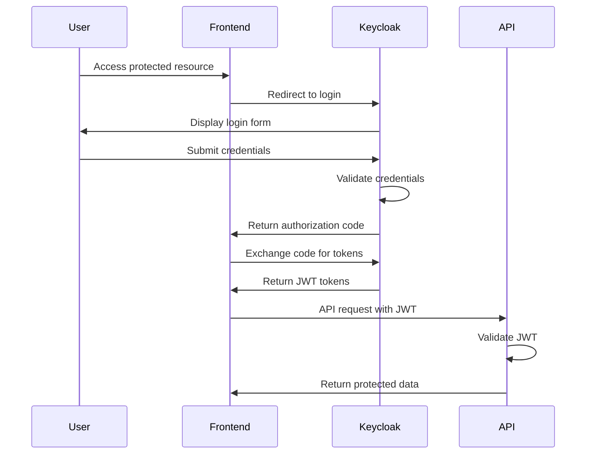

# MakrX Security Guide

## 🔒 Security Overview

Security is a fundamental principle in the MakrX ecosystem design. This guide covers authentication, authorization, data protection, and security best practices implemented across all components.

## 🏗️ Security Architecture

### Defense in Depth Strategy
```
┌─────────────────────────────────────────┐
│             User Layer                  │
│  • Strong passwords                     │
│  • Multi-factor authentication         │
│  • Session management                  │
└─────────────────────────────────────────┘
                     │
┌───────────────────��─────────────────────┐
│           Network Layer                 │
│  • HTTPS/TLS encryption                │
│  • Rate limiting                       │
│  • CORS protection                     │
│  • DDoS protection                     │
└─────────────────────────────────────────┘
                     │
┌─────────────────────────────────────────┐
│         Application Layer               │
│  • JWT token validation                │
│  • Role-based access control           │
│  • Input validation                    │
│  • SQL injection prevention            │
└─────────────────────────────────────────┘
                     │
┌─────────────────────────────────────────┐
│            Data Layer                   │
│  • Encryption at rest                  │
│  • Database access controls            │
│  • Audit logging                       │
│  • Backup encryption                   │
└─────────────────────────────────────────┘
```

## 🔐 Authentication System

### Keycloak SSO Integration
MakrX uses Keycloak as the central identity provider, enabling Single Sign-On across all domains.

#### Authentication Flow


#### JWT Token Structure
```json
{
  "header": {
    "alg": "RS256",
    "typ": "JWT",
    "kid": "key-id"
  },
  "payload": {
    "sub": "user-uuid",
    "iss": "https://auth.makrx.org",
    "aud": ["makrx-api"],
    "exp": 1640995200,
    "iat": 1640908800,
    "email": "user@example.com",
    "name": "John Doe",
    "roles": ["member", "makerspace_admin"],
    "makerspaces": ["makerspace-uuid"],
    "permissions": ["equipment.view", "inventory.edit"]
  }
}
```

### Password Security
- **Minimum Requirements**: 12 characters, mixed case, numbers, symbols
- **Storage**: Passwords hashed with bcrypt (cost factor: 12)
- **Reset**: Secure token-based password reset with expiration
- **History**: Previous 5 passwords stored to prevent reuse

```python
# Password hashing implementation
import bcrypt

def hash_password(password: str) -> str:
    """Hash password using bcrypt with salt."""
    salt = bcrypt.gensalt(rounds=12)
    return bcrypt.hashpw(password.encode('utf-8'), salt).decode('utf-8')

def verify_password(password: str, hashed: str) -> bool:
    """Verify password against hash."""
    return bcrypt.checkpw(password.encode('utf-8'), hashed.encode('utf-8'))
```

### Multi-Factor Authentication
- **TOTP Support**: Time-based one-time passwords via authenticator apps
- **Backup Codes**: Single-use recovery codes
- **SMS Fallback**: Optional SMS-based 2FA
- **Hardware Keys**: FIDO2/WebAuthn support

## 🛡️ Authorization & Access Control

### Role-Based Access Control (RBAC)
The system implements hierarchical role-based permissions with makerspace-scoped access.

#### Role Hierarchy
```
Super Admin
├── System-wide access
├── All makerspace management
└── Feature flag control

Admin
├── Organization-wide access
├── User management
└── Analytics access

Makerspace Admin
├── Makerspace-scoped access
├── Member management
├── Equipment management
└── Inventory control

Service Provider
├── Job management
├── Order fulfillment
└── Provider dashboard

Member
├── Equipment reservations
├── Project collaboration
└── Basic inventory view

Guest
├── Public content access
└── Registration capability
```

#### Permission Matrix
| Resource | Super Admin | Admin | Makerspace Admin | Service Provider | Member | Guest |
|----------|-------------|-------|------------------|------------------|--------|-------|
| Users | Full | Read/Edit | Makerspace only | None | Own profile | None |
| Makerspaces | Full | Read | Assigned only | None | Read assigned | Read public |
| Equipment | Full | Read | Makerspace CRUD | None | Reserve/View | None |
| Inventory | Full | Read | Makerspace CRUD | View orders | View available | None |
| Projects | Full | Read | Makerspace view | None | Own/Collaborate | None |
| Orders | Full | Read all | Makerspace only | Own orders | Own orders | None |
| Analytics | Full | All data | Makerspace only | Provider metrics | None | None |
| Billing | Full | Read all | Makerspace only | Provider revenue | Own billing | None |

### Permission Implementation
```python
# Role-based permission checking
def check_permission(user: User, resource: str, action: str, resource_id: str = None) -> bool:
    """Check if user has permission for resource action."""
    
    # Super admins have all permissions
    if "super_admin" in user.roles:
        return True
    
    # Get role permissions
    role_permissions = get_role_permissions(user.primary_role)
    resource_perms = role_permissions.get(resource, {})
    
    # Check base permission
    if not resource_perms.get(action, False):
        return False
    
    # Apply scope restrictions
    if resource_id and requires_scope_check(resource, action):
        return check_scope_access(user, resource, resource_id)
    
    return True

def require_permission(resource: str, action: str):
    """Decorator to enforce permissions on API endpoints."""
    def decorator(func):
        async def wrapper(*args, **kwargs):
            user = get_current_user()
            resource_id = kwargs.get('makerspace_id') or kwargs.get('id')
            
            if not check_permission(user, resource, action, resource_id):
                raise HTTPException(
                    status_code=403,
                    detail="Insufficient permissions"
                )
            
            return await func(*args, **kwargs)
        return wrapper
    return decorator

# Usage example
@router.get("/makerspaces/{makerspace_id}/equipment")
@require_permission("equipment", "view")
async def list_equipment(makerspace_id: str, current_user: User = Depends(get_current_user)):
    # Function implementation
    pass
```

## 🔒 Data Protection

### Encryption at Rest
- **Database**: AES-256 encryption for sensitive columns
- **File Storage**: Server-side encryption with AWS S3/MinIO
- **Backups**: Encrypted database dumps with separate key management
- **Configuration**: Encrypted environment variables and secrets

```python
# Sensitive data encryption
from cryptography.fernet import Fernet
import os

class DataEncryption:
    def __init__(self):
        self.key = os.environ.get('ENCRYPTION_KEY').encode()
        self.cipher = Fernet(self.key)
    
    def encrypt(self, data: str) -> str:
        """Encrypt sensitive data."""
        return self.cipher.encrypt(data.encode()).decode()
    
    def decrypt(self, encrypted_data: str) -> str:
        """Decrypt sensitive data."""
        return self.cipher.decrypt(encrypted_data.encode()).decode()

# Database model with encryption
class CreditCard(Base):
    __tablename__ = "credit_cards"
    
    id = Column(UUID, primary_key=True)
    user_id = Column(UUID, ForeignKey("users.id"))
    encrypted_number = Column(String)  # Encrypted card number
    last_four = Column(String(4))       # Plain text for display
    encrypted_cvv = Column(String)      # Encrypted CVV
    expiry_month = Column(Integer)
    expiry_year = Column(Integer)
    
    @property
    def card_number(self) -> str:
        return encryption.decrypt(self.encrypted_number)
    
    @card_number.setter
    def card_number(self, value: str):
        self.encrypted_number = encryption.encrypt(value)
        self.last_four = value[-4:]
```

### Encryption in Transit
- **HTTPS**: TLS 1.3 for all web traffic
- **API Security**: JWT tokens with RS256 signing
- **Database**: SSL connections with certificate validation
- **File Uploads**: Secure multipart uploads with validation

```nginx
# TLS configuration
ssl_protocols TLSv1.2 TLSv1.3;
ssl_ciphers ECDHE-ECDSA-AES256-GCM-SHA384:ECDHE-RSA-AES256-GCM-SHA384;
ssl_prefer_server_ciphers off;
ssl_session_cache shared:TLS:2m;
ssl_session_timeout 1d;
ssl_session_tickets off;

# Security headers
add_header Strict-Transport-Security "max-age=63072000; includeSubDomains; preload" always;
add_header X-Frame-Options "SAMEORIGIN" always;
add_header X-Content-Type-Options "nosniff" always;
add_header Referrer-Policy "strict-origin-when-cross-origin" always;
add_header Content-Security-Policy "default-src 'self'; script-src 'self' 'unsafe-inline'; style-src 'self' 'unsafe-inline';" always;
```

## 🚫 Input Validation & Sanitization

### API Input Validation
All API inputs are validated using Pydantic schemas with strict type checking and custom validators.

```python
# Input validation schemas
from pydantic import BaseModel, validator, Field
from typing import Optional
import re

class UserCreateSchema(BaseModel):
    email: str = Field(..., regex=r'^[a-zA-Z0-9._%+-]+@[a-zA-Z0-9.-]+\.[a-zA-Z]{2,}$')
    name: str = Field(..., min_length=2, max_length=100)
    password: str = Field(..., min_length=12)
    
    @validator('password')
    def validate_password_strength(cls, v):
        if not re.search(r'[A-Z]', v):
            raise ValueError('Password must contain uppercase letter')
        if not re.search(r'[a-z]', v):
            raise ValueError('Password must contain lowercase letter')
        if not re.search(r'[0-9]', v):
            raise ValueError('Password must contain number')
        if not re.search(r'[!@#$%^&*(),.?":{}|<>]', v):
            raise ValueError('Password must contain special character')
        return v

class EquipmentCreateSchema(BaseModel):
    name: str = Field(..., min_length=1, max_length=200)
    type: EquipmentType
    location: Optional[str] = Field(None, max_length=100)
    hourly_rate: Optional[float] = Field(None, ge=0, le=1000)
    
    @validator('name')
    def sanitize_name(cls, v):
        # Remove potentially dangerous characters
        return re.sub(r'[<>"\']', '', v.strip())
```

### SQL Injection Prevention
- **ORM Usage**: SQLAlchemy ORM prevents most SQL injection
- **Parameterized Queries**: All raw queries use parameter binding
- **Input Sanitization**: Strict validation of all database inputs
- **Least Privilege**: Database users have minimal required permissions

```python
# Safe database operations
from sqlalchemy.orm import Session
from sqlalchemy import text

# ✅ Safe - Using ORM
def get_user_by_email(db: Session, email: str) -> User:
    return db.query(User).filter(User.email == email).first()

# ✅ Safe - Parameterized query
def get_equipment_stats(db: Session, makerspace_id: str) -> dict:
    result = db.execute(
        text("SELECT status, COUNT(*) FROM equipment WHERE makerspace_id = :makerspace_id GROUP BY status"),
        {"makerspace_id": makerspace_id}
    )
    return dict(result.fetchall())

# ❌ Dangerous - Never do this
def unsafe_query(db: Session, user_input: str):
    # This is vulnerable to SQL injection
    db.execute(f"SELECT * FROM users WHERE name = '{user_input}'")
```

## 🔍 Security Monitoring & Auditing

### Audit Logging
All security-relevant events are logged with detailed context for forensic analysis.

```python
# Audit logging system
from datetime import datetime
from enum import Enum

class AuditEventType(str, Enum):
    LOGIN_SUCCESS = "login_success"
    LOGIN_FAILED = "login_failed"
    PASSWORD_CHANGED = "password_changed"
    PERMISSION_DENIED = "permission_denied"
    DATA_ACCESS = "data_access"
    DATA_MODIFIED = "data_modified"
    ADMIN_ACTION = "admin_action"

class AuditLog(Base):
    __tablename__ = "audit_logs"
    
    id = Column(UUID, primary_key=True, default=uuid4)
    event_type = Column(Enum(AuditEventType), nullable=False)
    user_id = Column(UUID, ForeignKey("users.id"))
    resource_type = Column(String)
    resource_id = Column(String)
    details = Column(JSON)
    ip_address = Column(String)
    user_agent = Column(String)
    timestamp = Column(DateTime, default=datetime.utcnow)

def log_audit_event(
    event_type: AuditEventType,
    user_id: str = None,
    resource_type: str = None,
    resource_id: str = None,
    details: dict = None,
    request: Request = None
):
    """Log security audit event."""
    audit_entry = AuditLog(
        event_type=event_type,
        user_id=user_id,
        resource_type=resource_type,
        resource_id=resource_id,
        details=details or {},
        ip_address=get_client_ip(request) if request else None,
        user_agent=request.headers.get("user-agent") if request else None
    )
    
    db.add(audit_entry)
    db.commit()

# Usage in API endpoints
@router.post("/login")
async def login(credentials: LoginSchema, request: Request):
    try:
        user = authenticate_user(credentials.email, credentials.password)
        if user:
            log_audit_event(
                AuditEventType.LOGIN_SUCCESS,
                user_id=user.id,
                details={"email": credentials.email},
                request=request
            )
            return create_tokens(user)
        else:
            log_audit_event(
                AuditEventType.LOGIN_FAILED,
                details={"email": credentials.email, "reason": "invalid_credentials"},
                request=request
            )
            raise HTTPException(status_code=401, detail="Invalid credentials")
    except Exception as e:
        log_audit_event(
            AuditEventType.LOGIN_FAILED,
            details={"email": credentials.email, "error": str(e)},
            request=request
        )
        raise
```

### Rate Limiting
Protect against brute force attacks and API abuse with intelligent rate limiting.

```python
# Rate limiting implementation
import redis
from fastapi import HTTPException
import time

class RateLimiter:
    def __init__(self, redis_client: redis.Redis):
        self.redis = redis_client
    
    def is_allowed(self, key: str, limit: int, window: int) -> bool:
        """Check if request is allowed under rate limit."""
        current_time = int(time.time())
        pipeline = self.redis.pipeline()
        
        # Sliding window rate limiting
        pipeline.zremrangebyscore(key, 0, current_time - window)
        pipeline.zadd(key, {str(current_time): current_time})
        pipeline.zcard(key)
        pipeline.expire(key, window)
        
        results = pipeline.execute()
        current_count = results[2]
        
        return current_count <= limit

# Rate limiting middleware
@app.middleware("http")
async def rate_limit_middleware(request: Request, call_next):
    client_ip = get_client_ip(request)
    
    # Different limits for different endpoints
    if request.url.path.startswith("/api/auth/login"):
        # Strict limit for login attempts
        if not rate_limiter.is_allowed(f"login:{client_ip}", 5, 300):  # 5 attempts per 5 minutes
            raise HTTPException(status_code=429, detail="Too many login attempts")
    
    elif request.url.path.startswith("/api/"):
        # General API rate limit
        if not rate_limiter.is_allowed(f"api:{client_ip}", 100, 60):  # 100 requests per minute
            raise HTTPException(status_code=429, detail="Rate limit exceeded")
    
    response = await call_next(request)
    return response
```

### Security Monitoring
Real-time security event monitoring with alerting capabilities.

```python
# Security monitoring system
class SecurityMonitor:
    def __init__(self):
        self.alert_thresholds = {
            "failed_logins": {"count": 10, "window": 300},  # 10 failed logins in 5 minutes
            "permission_denied": {"count": 20, "window": 600},  # 20 denials in 10 minutes
            "suspicious_activity": {"count": 5, "window": 300}
        }
    
    def check_security_alerts(self, event_type: str, user_id: str = None):
        """Check if security event triggers an alert."""
        threshold = self.alert_thresholds.get(event_type)
        if not threshold:
            return
        
        # Count recent events
        recent_events = self.get_recent_events(event_type, threshold["window"], user_id)
        
        if len(recent_events) >= threshold["count"]:
            self.trigger_security_alert(event_type, recent_events)
    
    def trigger_security_alert(self, event_type: str, events: list):
        """Trigger security alert and take defensive actions."""
        alert = {
            "type": "security_alert",
            "event_type": event_type,
            "count": len(events),
            "timestamp": datetime.utcnow().isoformat(),
            "events": events[:10]  # Include sample events
        }
        
        # Send alert to security team
        self.send_security_alert(alert)
        
        # Take automated defensive actions
        if event_type == "failed_logins":
            self.temporary_ip_ban(events[0]["ip_address"])
        elif event_type == "permission_denied":
            self.flag_user_for_review(events[0]["user_id"])
```

## 🛠️ Security Tools & Practices

### Dependency Security
Regular scanning and updating of dependencies to address known vulnerabilities.

```bash
# Python dependency security scanning
poetry add --group dev safety
poetry run safety check

# Node.js dependency security scanning
npm audit
npm audit fix

# Container security scanning
docker scout quickview makrx/makrcave-api:latest
```

### Static Code Analysis
Automated code analysis to identify security vulnerabilities.

```bash
# Python static analysis
poetry add --group dev bandit semgrep
poetry run bandit -r ./src
poetry run semgrep --config=auto ./src

# JavaScript/TypeScript analysis
npm install --save-dev eslint-plugin-security
npx eslint --ext .ts,.tsx ./src
```

### Secrets Management
Secure handling of sensitive configuration and credentials.

```python
# Secrets management with HashiCorp Vault (optional)
import hvac

class SecretsManager:
    def __init__(self, vault_url: str, vault_token: str):
        self.client = hvac.Client(url=vault_url, token=vault_token)
    
    def get_secret(self, path: str, key: str) -> str:
        """Retrieve secret from Vault."""
        response = self.client.secrets.kv.v2.read_secret_version(path=path)
        return response['data']['data'][key]
    
    def set_secret(self, path: str, secret: dict):
        """Store secret in Vault."""
        self.client.secrets.kv.v2.create_or_update_secret(
            path=path,
            secret=secret
        )

# Environment-based secrets for development
import os
from typing import Optional

def get_secret(key: str, default: Optional[str] = None) -> str:
    """Get secret from environment or Vault."""
    # Try environment first (development)
    value = os.environ.get(key)
    if value:
        return value
    
    # Try Vault in production
    if hasattr(app.state, 'secrets_manager'):
        return app.state.secrets_manager.get_secret('makrx/config', key)
    
    if default is not None:
        return default
    
    raise ValueError(f"Secret {key} not found")
```

### File Upload Security
Secure handling of user file uploads with virus scanning and validation.

```python
# Secure file upload handling
import magic
from pathlib import Path

class FileUploadSecurity:
    def __init__(self):
        self.allowed_extensions = {'.stl', '.obj', '.png', '.jpg', '.jpeg', '.pdf'}
        self.max_file_size = 50 * 1024 * 1024  # 50MB
        self.allowed_mime_types = {
            'application/sla',
            'model/stl',
            'image/png',
            'image/jpeg',
            'application/pdf'
        }
    
    def validate_file(self, file_path: Path, original_filename: str) -> bool:
        """Validate uploaded file for security."""
        
        # Check file size
        if file_path.stat().st_size > self.max_file_size:
            raise ValueError("File too large")
        
        # Check file extension
        extension = Path(original_filename).suffix.lower()
        if extension not in self.allowed_extensions:
            raise ValueError(f"File type {extension} not allowed")
        
        # Check MIME type
        mime_type = magic.from_file(str(file_path), mime=True)
        if mime_type not in self.allowed_mime_types:
            raise ValueError(f"MIME type {mime_type} not allowed")
        
        # Scan for malware (integrate with ClamAV or similar)
        if self.contains_malware(file_path):
            raise ValueError("File contains malware")
        
        return True
    
    def sanitize_filename(self, filename: str) -> str:
        """Sanitize filename to prevent path traversal."""
        # Remove path components
        filename = Path(filename).name
        
        # Remove dangerous characters
        safe_chars = re.sub(r'[^a-zA-Z0-9._-]', '_', filename)
        
        # Ensure reasonable length
        if len(safe_chars) > 255:
            name, ext = os.path.splitext(safe_chars)
            safe_chars = name[:255-len(ext)] + ext
        
        return safe_chars

# Secure file upload endpoint
@router.post("/upload")
async def upload_file(
    file: UploadFile = File(...),
    current_user: User = Depends(get_current_user)
):
    """Secure file upload with validation."""
    
    # Validate file
    security = FileUploadSecurity()
    
    # Create temporary file
    with tempfile.NamedTemporaryFile(delete=False) as temp_file:
        content = await file.read()
        temp_file.write(content)
        temp_path = Path(temp_file.name)
    
    try:
        # Validate file security
        security.validate_file(temp_path, file.filename)
        
        # Generate secure filename
        safe_filename = security.sanitize_filename(file.filename)
        unique_filename = f"{uuid4()}_{safe_filename}"
        
        # Store in secure location
        storage_path = await store_file_securely(temp_path, unique_filename)
        
        # Log upload event
        log_audit_event(
            AuditEventType.DATA_ACCESS,
            user_id=current_user.id,
            resource_type="file_upload",
            details={"filename": safe_filename, "size": len(content)}
        )
        
        return {"file_id": unique_filename, "status": "uploaded"}
        
    finally:
        # Clean up temporary file
        temp_path.unlink(missing_ok=True)
```

## 🔧 Security Configuration

### Environment-Specific Security Settings
```python
# Security configuration per environment
class SecurityConfig:
    def __init__(self, environment: str):
        self.environment = environment
    
    @property
    def password_min_length(self) -> int:
        return 12 if self.environment == 'production' else 8
    
    @property
    def session_timeout(self) -> int:
        return 3600 if self.environment == 'production' else 7200  # 1 hour vs 2 hours
    
    @property
    def rate_limit_strict(self) -> bool:
        return self.environment == 'production'
    
    @property
    def require_https(self) -> bool:
        return self.environment != 'development'
    
    @property
    def audit_all_requests(self) -> bool:
        return self.environment == 'production'
```

### Security Headers Configuration
```python
# Security headers middleware
@app.middleware("http")
async def security_headers_middleware(request: Request, call_next):
    response = await call_next(request)
    
    # Security headers
    response.headers["X-Content-Type-Options"] = "nosniff"
    response.headers["X-Frame-Options"] = "DENY"
    response.headers["X-XSS-Protection"] = "1; mode=block"
    response.headers["Referrer-Policy"] = "strict-origin-when-cross-origin"
    response.headers["Permissions-Policy"] = "geolocation=(), microphone=(), camera=()"
    
    # HSTS for HTTPS
    if request.url.scheme == "https":
        response.headers["Strict-Transport-Security"] = "max-age=31536000; includeSubDomains"
    
    # CSP header
    csp = "default-src 'self'; script-src 'self' 'unsafe-inline'; style-src 'self' 'unsafe-inline'; img-src 'self' data: https:; font-src 'self'"
    response.headers["Content-Security-Policy"] = csp
    
    return response
```

## 🚨 Incident Response

### Security Incident Playbook

#### 1. Detection & Analysis
```python
# Automated threat detection
class ThreatDetector:
    def detect_anomalies(self, user_activity: dict) -> list:
        """Detect suspicious user activity patterns."""
        anomalies = []
        
        # Multiple failed logins from different IPs
        if user_activity['failed_logins'] > 10 and user_activity['unique_ips'] > 5:
            anomalies.append("credential_stuffing")
        
        # Unusual access patterns
        if user_activity['access_outside_hours'] and user_activity['new_device']:
            anomalies.append("suspicious_access")
        
        # Privilege escalation attempts
        if user_activity['permission_denials'] > 20:
            anomalies.append("privilege_escalation")
        
        return anomalies
```

#### 2. Containment
- **Account Lockdown**: Temporarily disable compromised accounts
- **IP Blocking**: Block malicious IP addresses
- **Session Termination**: Invalidate active sessions
- **Rate Limiting**: Implement stricter rate limits

#### 3. Investigation & Recovery
- **Forensic Analysis**: Analyze audit logs and system traces
- **Impact Assessment**: Determine scope of potential data exposure
- **System Restoration**: Restore from secure backups if necessary
- **Vulnerability Patching**: Address security vulnerabilities

#### 4. Post-Incident Activities
- **Incident Documentation**: Record lessons learned
- **Security Updates**: Implement additional protections
- **User Notification**: Inform affected users if required
- **Compliance Reporting**: Report to relevant authorities

## 📋 Security Checklist

### Development Security Checklist
- [ ] All API endpoints require authentication
- [ ] Input validation on all user inputs
- [ ] SQL injection prevention (parameterized queries)
- [ ] XSS prevention (output encoding)
- [ ] CSRF protection for state-changing operations
- [ ] Secure file upload handling
- [ ] Rate limiting on sensitive endpoints
- [ ] Security headers implemented
- [ ] Error messages don't leak sensitive information
- [ ] Dependencies regularly updated and scanned

### Deployment Security Checklist
- [ ] HTTPS/TLS configured correctly
- [ ] Database connections encrypted
- [ ] Secrets managed securely (not in code)
- [ ] Regular security backups
- [ ] Monitoring and alerting configured
- [ ] Access logs enabled
- [ ] Firewall rules properly configured
- [ ] Regular security assessments scheduled
- [ ] Incident response plan documented
- [ ] Security training provided to team

### Ongoing Security Maintenance
- [ ] Monthly dependency updates
- [ ] Quarterly security assessments
- [ ] Annual penetration testing
- [ ] Regular access reviews
- [ ] Security awareness training
- [ ] Compliance audits
- [ ] Disaster recovery testing
- [ ] Security metrics monitoring

---

This security guide provides comprehensive coverage of the security measures implemented in the MakrX ecosystem. Regular review and updates of these security practices ensure ongoing protection against evolving threats.
